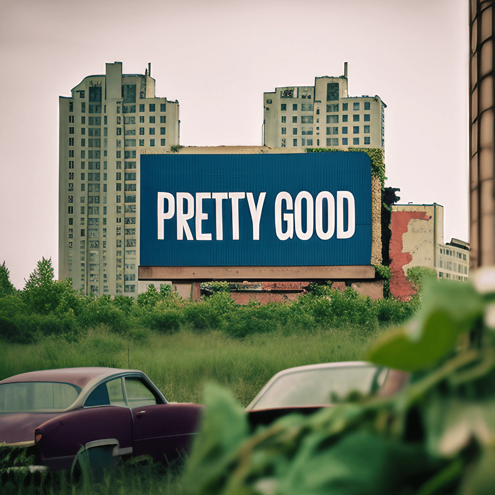
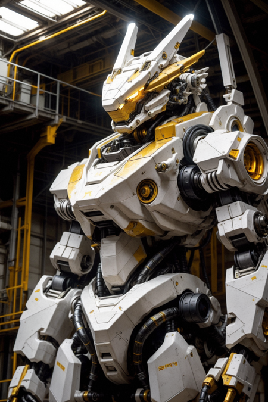
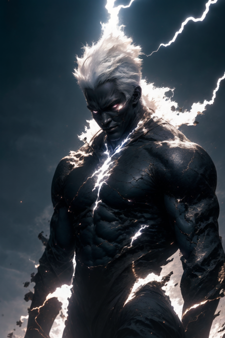
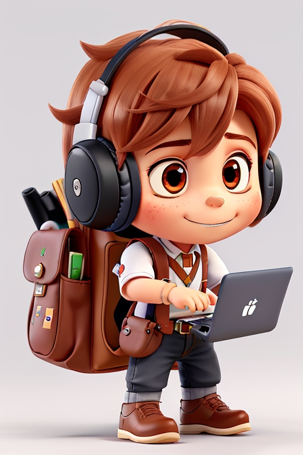

# 0.0.2
0.0.2 | Stable Diffusion Hackathon

## Challenge

Using AI Image Generation tools, build an avatar builder that allows the user to create a customizable avatar using the least amount of prompts to the user. Feel free to build anything to accomplish. You can run stable diffusion on your box and build a custom UI on top of it or just use online tools for image generation.


Submit your solution to this repo in a folder with your team name.


### Deliverables:
1. AI Prompt (i.e. Mad libs for ChatGPT)
2. Backend code running image generation on your box (optional)
3. User Interface (optional)

###### Example Models:
[RunwayML's original Stable Diffusion1.5 model](https://huggingface.co/runwayml/stable-diffusion-v1-5/resolve/main/v1-5-pruned-emaonly.safetensors)


[Stable Diffusion 2 - StabilityAI's model for 512x512](https://huggingface.co/stabilityai/stable-diffusion-2-base/resolve/main/512-base-ema.safetensors)


[Midjourney Replica](https://huggingface.co/Joeythemonster/anything-midjourney-v-4-1/resolve/main/ANYTHING_MIDJOURNEY_V_4.1.safetensors)


[SDXL - Generates in 1024x1024, a little more difficult to set up but could make better results](https://huggingface.co/stabilityai/stable-diffusion-xl-base-1.0/resolve/main/sd_xl_base_1.0.safetensors)

[SDXL VAE](https://huggingface.co/stabilityai/stable-diffusion-xl-base-1.0/resolve/main/sd_xl_base_1.0_0.9vae.safetensors)

[SDXL Refiner](https://huggingface.co/stabilityai/stable-diffusion-xl-refiner-1.0/resolve/main/sd_xl_refiner_1.0.safetensors)

[SDXL Refiner VAE](https://huggingface.co/stabilityai/stable-diffusion-xl-refiner-1.0/resolve/main/sd_xl_refiner_1.0_0.9vae.safetensors)

[Apple's SDXL for running on Mac M1/M2 GPUs](https://huggingface.co/apple/coreml-stable-diffusion-xl-base/resolve/main/coreml-stable-diffusion-xl-base_original_compiled.zip)



[3D Animation Diffusion base model - Disney/Pixar style outputs](https://civitai.com/api/download/models/128046)


[AbsoluteReality - Realism focused model](https://civitai.com/api/download/models/132760)



[Dreamshaper8 - Distinctly AI generated model](https://civitai.com/api/download/models/128713)



###### Example Prompt:

```Chibi-style, 3D, <Descriptor> student using a backpack, <clothing>, holding a <item>, wearing headphones, is a <descriptor>```

Filled In Example:

```Chibi-style, 3D, Swiss student using a backpack, lederhosen, holding a laptop, wearing headphones, is a boy```

Generated Image

